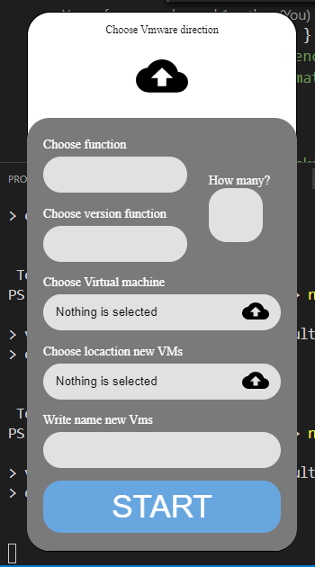

# Multiple-Vms-with-node.js

Program for multiple virtual machine. Using Vmare workstation PRO API "vmrun". 🥰

## Tools & Technologies I've used
* VSC
* Figma
* CSS Flexbox
* Javascript - node.js / electron
* npm
* VMs Pro API

## List to do

* do custom bar
* check if a clone with this name exists
* save last selected options in local storage
